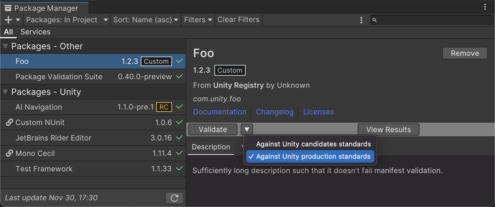
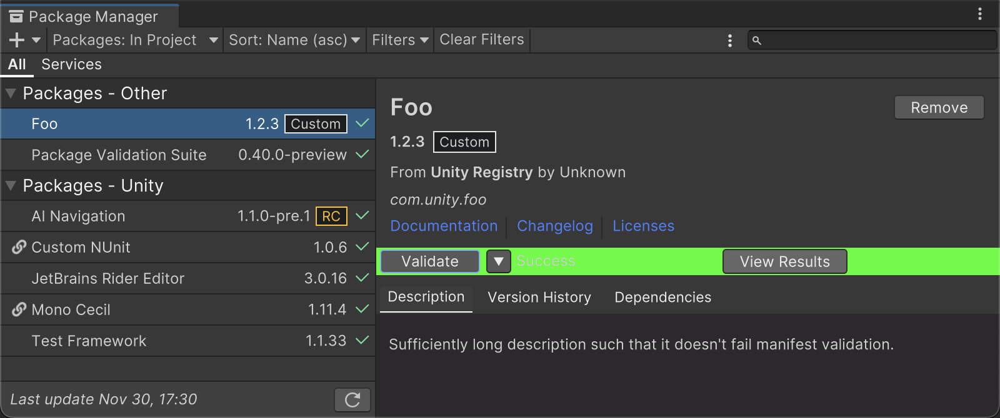
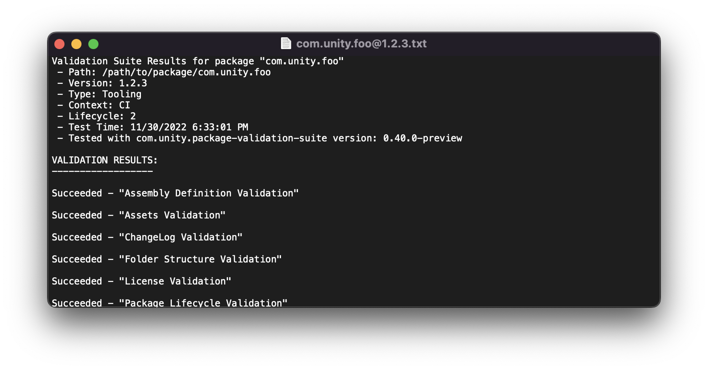

### **_Package Validation Suite_**

Use the package validation suite to verify your package, making sure it meets Unity's package hosting standards before you submit your package for publishing.

### Pre-requisites
The Package Validation Suite requires the Package Manager UI extension mechanism, which is available from version 1.9.3 or later or can be found in Unity 2019.2 or later.

### Installation
To add the Package Validation Suite to your project, please use the Package Manager UI to install the latest version of the package.

## Validate Package
As shown below, once the validation package is installed in your project, the Package Manager UI will expose a new "Validate" option in the details section of the UI.

 By pressing the `Validate` button in the details pane of a package in development, the validation process will begin.  The following will take place:
 - The package being tested will get "built", to reflect the file set it will contain.
 - The previous version of the package will get downloaded, for comparison and upgrade testing.
 - The validation tests will get run.
 - A report will be produced for viewing.

 Note that there are two different validation types available via the dropdown next to the validate button:
- _Against Unity candidates standards_: Run validation required to publish a package to the candidates registry.
- _Against Unity production standards_: Run validation required to promote a package to the production registry.

 

 To view the report, click __View Results__.

 

## Known Limitations

* This is a temporary UI for internal development only.
* Not all validation tests are implemented, more to come!

# Technical details

## Requirements

This version of Unity Package Manager is compatible with the following versions of the Unity Editor:

* 2018.4 and later (recommended)
